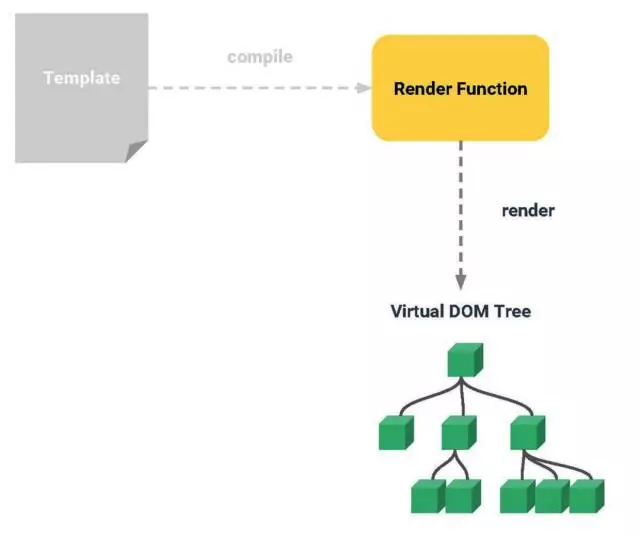
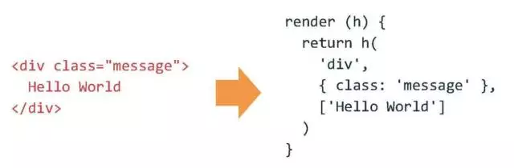
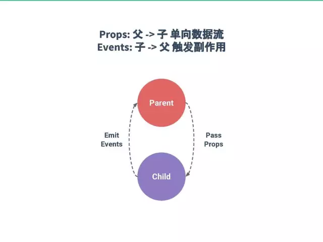
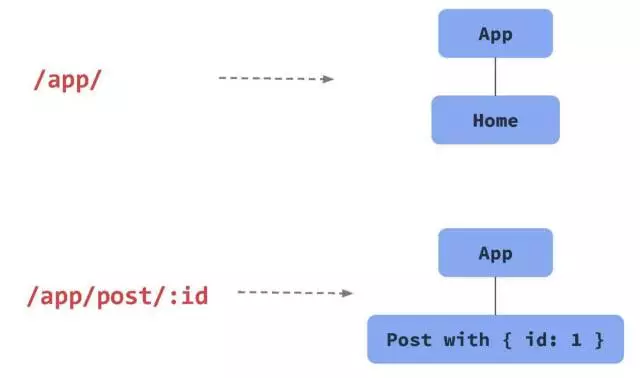
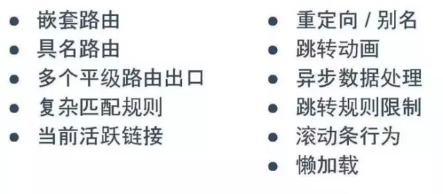
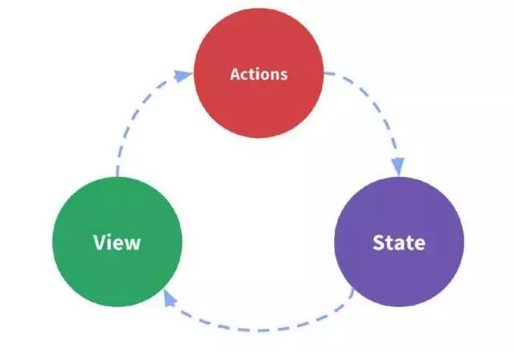
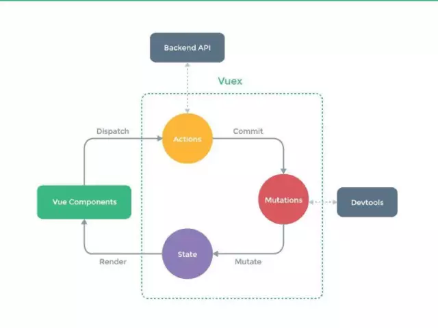
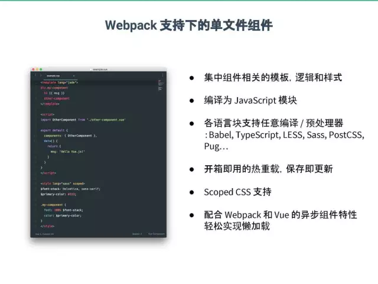

# VUE简介
> Vue.js（读音 /vjuː/, 类似于 view） 是一套构建用户界面的渐进式框架。与其他重量级框架不同的是，Vue 采用自底向上增量开发的设计。
Vue的核心库只关注视图层，并且非常容易学习，非常容易与其它库或已有项目整合。另一方面，Vue完全有能力驱动采用单文件组件和Vue生态系统支持的库开发的复杂单页应用。
Vue.js的目标是通过尽可能简单的API实现响应的数据绑定和组合的视图组件。

- 官网地址：[https://vuejs.org/](https://vuejs.org/)
- 中文网地址：[http://cn.vuejs.org/](http://cn.vuejs.org/)

> 我在2015接触vue，因为vue特性，只兼容支持es5浏览器，对于当时还需要兼容ie9以下浏览器的时代来说，兼容在前端是一个很头疼的问题，也是核心问题，所有问题都是围绕它为生最后到死。
2016时候用vue写了几个小dome，[vue版TODOS](https://github.com/jiayisheji/vue-todos),[仿饿了么招聘](https://github.com/jiayisheji/vue-elema)。当然这些都是基于vue1.x的版本，我们本次项目主要以vue2x来做项目，也顺便学习一下。
学习一门新技术，一定要去先去它的官网瞧瞧，现在新技术都是开源，github看看它的代码。每样技术都有优势和劣势，这是正常的，不可避免的。我们为什么要用它，就是因为它的优势，但是要避免它的劣势给我们带来业务问题，影响开发效率。如果弊大于利，就必须要放弃选择，如果利大于弊，可以优先选择。

## 关于渐进式框架
> vue2定位渐进式框架，那什么是渐进式框架。

接下来我们先看的图：

这是vue作者提出的一个概念，也是vue2定位。
Vue从设计角度来讲，虽然能够涵盖这张图上所有的东西，但是你并不需要一上手就把所有东西全用上，因为没有必要。无论从学习角度，还是实际情况，这都是可选的。声明式渲染和组建系统是Vue的核心库所包含内容，而客户端路由、状态管理、构建工具都有专门解决方案。这些解决方案相互独立，你可以在核心的基础上任意选用其他的部件，不一定要全部整合在一起。

## Vue的实现
### （1）声明式渲染
现在基本所有的框架都已经认同这个看法——DOM应尽可能是一个函数式到状态的映射。状态即是唯一的真相，而DOM状态只是数据状态的一个映射。如下图所示，所有的逻辑尽可能在状态的层面去进行，当状态改变的时候，View应该是在框架帮助下自动更新到合理的状态，而不是说当你观测到数据变化之后手动选择一个元素，再命令式地去改动它的属性。

下图是Vue的一个模板示例，如果没有用过Vue的话，可以大概感觉到这是一个怎样的概念。

其实，在模板语法上，Vue跟Angular是比较相似。在Vue1.0里面，模板实现跟Angular类似，如下图所示，把模板直接做成在浏览器里面parse成DOM树，然后去遍历这个树，提取其中的各种绑定。

在Vue2.0中，渲染层的实现做了根本性改动，那就是引入了虚拟DOM。

从架构来讲，Vue2.0 依然是写一样的模板，（Vue2.0于前段时间发布，具体报道：更轻更快的Vue.js 2.0）。在最左边，Vue2.0跟1.0的模板语法绝大部分是兼容的。Vue的编译器在编译模板之后，会把这些模板编译成一个渲染函数。而函数被调用的时候就会渲染并且返回一个虚拟DOM的树。这个树非常轻量，它的职责就是描述当前界面所应处的状态。当我们有了这个虚拟的树之后，再交给一个patch函数，负责把这些虚拟DOM真正施加到真实的DOM上。在这个过程中，Vue有自身的响应式系统来侦测在渲染过程中所依赖到的数据来源。在渲染过程中，侦测到的数据来源之后，之后就可以精确感知数据源的变动。到时候就可以根据需要重新进行渲染。当重新进行渲染之后，会生成一个新的树，将新树与旧树进行对比，就可以最终得出应施加到真实DOM上的改动。最后再通过patch函数施加改动。

这样做的主要原因是，在浏览器当中，JavaScript的运算在现代的引擎中非常快，但DOM本身是非常缓慢的东西。当你调用原生DOM API的时候，浏览器需要在JavaScript引擎的语境下去接触原生的DOM的实现，这个过程有相当的性能损耗。所以，本质的考量是，要把耗费时间的操作尽量放在纯粹的计算中去做，保证最后计算出来的需要实际接触真实DOM的操作是最少的。

下面看渲染函数。用过React的开发者可能知道，React是没有模板的，直接就是一个渲染函数，它中间返回的就是一个虚拟DOM树。JSX实际就是一套用于让我们更简单地去描述树状结构的语法糖。

如下图所示，在Vue2.0当中，可以看到就是说当比如左侧的模板，经过Vue的编译之后就会变成右侧的东西。

这个函数类似于创建一个虚拟元素的函数，我们可以给它一个名字，给它描述应该有的属性特性和可能其他的数据。然后后面这个最后这个参数是个数组，包含了该虚拟元素的子元素。总的来说2.0的编译器做的就是这个活。

同时，在Vue2.0里，用户可以选择直接跳过模板这一层去手写渲染函数，同时也有可选JSX支持。从开发者的偏好以及开发者的效益的角度来考量，模板和JSX是各有利弊的东西。模板更贴近我们的HTML，可以让我们更直观地思考语义结构，更好地结合CSS的书写。JSX和直接渲染函数，因为是真正的JavaScript，拥有这个语言本身的所有的能力，可以进行复杂的逻辑判断，进行选择性的返回最终要返回的DOM结构，能够实现一些在模板的语法限制下，很难做到的一些事情。

所以在Vue2.0里，两个都是可以选择的。在绝大部分情况下使用模板，但是在需要复杂逻辑的情况下，使用渲染函数。在Vue2.0的路由和内部的一些实践上，都大量地应用渲染函数做复杂的抽象组件，比如过渡动画组件以及路由里面的link组件，都是用渲染函数实现的，同时还保留了它本身的依赖追踪系统。

如下图所示，Vue的依赖追踪通过ES5的 Object.defineProperty 方法实现。比如，我们给它一个原生对象，Vue会遍历这个数据对象的属性，然后进行属性转换。每一个属性会被转换为一个 getter 和一个 setter。同时每个组件会有一个对应的 watcher 对象，这个对象的职责就是在当前组件被渲染的时候，记录数据上面的哪些属性被用到了。

例如，在渲染函数里面用到A.B的时候，这个就会触发对应的 getter。整个渲染流程具体要点如下：
- 当某个数据属性被用到时，触发 getter，这个属性就会被作为依赖被 watcher 记录下来。
- 整个函数被渲染完的时候，每一个被用到的数据属性都会被记录。
- 相应的数据变动时，例如给它一个新的值，就会触发 setter，通知数据对象对应数据有变化。
- 此时会通知对应的组件，其数据依赖有所改动，需要重新渲染。
- 对应的组件再次调动渲染函数，生成 Virtual DOM，实现 DOM 更新。

这样一个流程跟主流的一些框架，例如React是有较大区别的。在React中，当组件复杂的时候需要用 shouldComponentUpdate 做优化。但是，它也有自己的各种坑，比如要确保该组件下面的组件不依赖外部的状态。虽说这在大部分情况下是够用的，但遇到极大复杂度的应用，遇到性能瓶颈的时候，这个流程优化起来也是相当复杂的一个话题。

如下图所示，在Vue里面由于依赖追踪系统的存在，当任意数据变动的时，Vue的每一个组件都精确地知道自己是否需要重绘，所以并不需要手动优化。用Vue渲染这些组件的时候，数据变了，对应的组件基本上去除了手动优化的必要性。

### （2）组件系统
相信基本上所有的现代框架都已经走向了组件化道路，Web Components 从规范层面做这个实践。主流框架都有各有不同的封装，但核心思想都是一样，把UI结构映射到恰当的组件树，如下图所示。

在Vue中，父子组件之间的通信是通过 props 传递。从父向子单向传递；而如果子组件想要在父组件作用里面产生副作用，就需要去派发事件。这样就形成一个基本的父子通信模式，在涉及大规模状态管理的时候会有额外的方案，这个后面会提到。

Vue的组件引入构建工具之后有一个单文件组件概念，如下图所示，就是这个Vue文件。在同一个Vue文件里，可以同时写 template, script 和 style，三个东西放在一个里面。同时，Vue的单文件组件和 Web Components 有一个本质不同，它是基于构建工具实现。这样的好处是有了一个构建的机会，可以对这些单文件组件做更多的分析处，在每一个语言块里可以单独使用不同的处理器，这点后面还会讲到。

### （3）客户端路由
在做一个界面复杂度非常的高应用时，它会有很多的状态，这样的应用显然不可能在每做一次操作后都刷新一个页面作为用户反馈。这就要这个应用有多个复杂的状态，同时这些状态还要对应到URL。有一个重要的功能叫做 deep-linking，也就是当用户浏览到一个URL，然后把它传给另外的人或者复制重新打开，应用需要直接渲染出这个URL对应的状态。这就意味着应用的URL和组件树的状态之间有一个映射关系，客户端路由的职责就是让这个映射关系声明式地对应起来。

若要自己实现一个这样的路由，看上去倒是很简单，用hash去模拟一下，就可以自己很快地做出很简单的路由。但事实上，客户端路由涉及很多更复杂的问题，如下图所示。

可能同一层的路由有多个不同的出口，还有着复杂的URL匹配规则，等等。这些问题如果都由自己去一一实现，那么复杂度是非常高的。而Vue基本都有对应的解决方案（router.vuejs.org）。配合Webpack还可以实现基于路由的懒加载，一条路径所对应的组件在打包的时候，会分离成另外一块，只有当该路由被访问的时候，才会被加载出来。这有相应的解决方案，同时也有实例。

### （4）状态管理

说到状态管理，本质上就是把整个应用抽象为下图中的循环。脸书最早提出 Flux 这个概念的时，也是一个很松散的概念，而且官方的实现本身做得很难用。所以，社区就做了各种各样的探索。图中的这三个东西是一个单向数据流，State 驱动 View 的渲染，而用户对 View 进行操作产生 Action，会使State产生变化，从而导致 View 重新渲染。

一个单独的Vue的组件，其实就已经是这样的结构。但是当多个这样的组件来配套的时候，就会遇到一个问题。每个组件都有它自己的状态，但整个应用的状态，跟组件之间并不一定存在一一对应的关系。这个状态可能是一个全局状态。那么状态到底放在哪里？大部分解决方案是把这个状态从组件树中提取出来，放在一个全局的 Store 里面。Vuex 也是这样做的，但是它是针对 Vue 做了特化。我们看到最左边就是Vue的组件，这些组件在大部分情况下，就不再有私有的状态，而是从全局的 Store 里面获取状态。Actions 和 Mutations 比较难用一两句话说清楚，大致就是当应用状态进行改变的时候，需要通过 Mutations 去显式地触发，而 Actions 则是负责异步和其他副作用。由于 Mutations 会被记录下来，我们可以把这些记录发到工具里面去做分析，甚至进行回滚。当发现bug的时候，这使得我们可以更好地理解大型应用中的状态变化。更多的细节，还请看官方文档（vuex.vuejs.org）。

### （5）构建工具
构建工具方面，Vue有一个官方的，全局安装的 vue-cli。这里有一个笔误。全局安装之后，我们就可以用 vue 命令创建一个新的项目，Vue 的 CLI 跟其他 CLI 不同之处在于，有多个可选模板，有简单的也有复杂的。极简的配置，更快的安装，可以更快的上手。它也有一个更完整的模板，包括单元测试在内的各种内容都涵盖，但是，它的复杂度也更高，这又涉及到根据用例来选择恰当复杂度的问题。所有的模板在创建之后，构建脚本都是通过 npm 脚本来执行，在国内安装 npm 依赖的时候有点卡，可以用 yarn 或者推荐用淘宝的 npm 镜象源，可以很大地提升安装速度。

之前提到了单文件组件，如下图所示，支持任意的处理器，开箱即用的热重载，所以组件都支持热重载 (hot-reload)。当你做了修改，不会刷新页面，只是对组件本身进行立刻重载，不会影响整个应用当前的状态。CSS也支持热重载。我们看下左下角，在使用这个预处理器的同时，我们只需要添加一个 scoped 特性，Vue 会通过对模板和CSS代码的解析改写，来模拟CSS的效果。同时单文件组件也支持懒加载，一个懒加载的组件和它的依赖会被打包成一个额外的包，只有被用到的时候才加载，这对首屏的加载速度也是很有帮助的。

如下图所示，这个开发者工具本身也是用Vue写的。

使用它的话可以看到我们当前应用的组件树结构。

点击组件，就可以观察这个组件当前的状态。也可以把这个组件发送到控制台里。同时这个开发者工具还有一个 Vuex 面板，如果你用了 Vuex，那么每次操作都会被记录下来，记录下来的状态之间可以进行跳转。除此之外，还支持把当前应用的状态快照发送给另外一个人，这个人可以在他的控制台里导入你发送的状态，就可以立刻跳转到你之前所在的状态。这对于重现一些 bug，或要描述当前状态都很有帮助。

## vue特点
### 易用
上手比较容易框架之一。
### 灵活
简单小巧的核心，渐进式技术栈，足以应付任何规模的应用。
### 性能
17kb min+gzip 运行大小 快虚拟 DOM 最省心的优化

> 后面会讲解整个admin路由，组件，功能模块规划，从admin登陆开始。