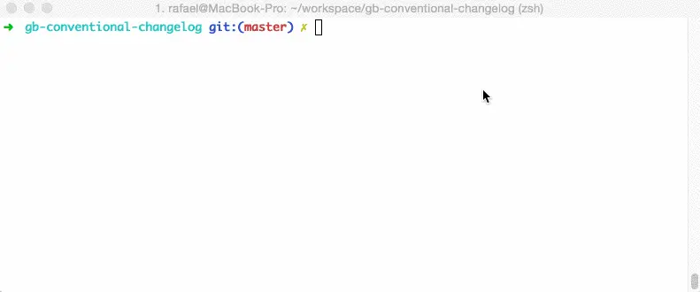

# 项目工程化配置

上一篇我们已经工欲善其事，必先利其器，解决构建工具以及开发工具。

古语云：无规矩不成方圆。

## 团队编码规范约束

一千个程序员，就有一千种代码风格。

那什么是代码风格呢？从小的来说，有的开发喜欢以分号结尾，有的不喜欢带分号。有的喜欢使用空格缩进，有的喜欢使用 `Tab` 键。有的喜欢缩进空两个空格，有的喜欢四个空格。除了这些，还有一些关于代码的优化，如避免声明未使用，避免冗余的代码逻辑等。

如果团队项目代码风格混乱，对于接手项目的人，只有苦不堪言。

各大公司都有自己的团队规范。

我一般构建完项目，就开始准备团队规范和项目配置。

有时候你的错误是真正的错误。有时它只是草率、不一致或不清晰的编码风格。其中一些一开始可能看起来微不足道，但随着代码库的增长和老化，随着越来越多的人涉足其中并做一些丑陋的事情，它们明显变得重要起来。

统一编码规范不仅可以大幅提高代码可读性，甚至会提高代码质量。当我们设计了一套关于编码规范的规则时，需要工具去辅助检测，这就是 `Lint`。

## ESLint 与约束

随着 `tslint` 弃用，`eslint` 已经算统一 `js`、`ts` 和 `j(t)sx` 的 `lint` 规范。

规则集需要统一集中配置，`ESLint` 会默认读取配置文件 `.eslintrc(.json)` 来解析，而规则集在 `rules` 中进行配置。

本项目中 `@nrwl/nx` 对 `ESLint` 的 `rules` 进行了定制。有一个特殊的规则 `@nrwl/nx/enforce-module-boundaries`，专门来约束我们导入模块。

Angular 也有根据 [Angular 风格指南](https://angular.cn/guide/styleguide) 专门定制的 `@angular-eslint` 库，来检查 `ts` 和 `html`。

`ESLint` 规则很多，我们可以设计属于自己团队的一套编码规范。

很多优秀的团队，都根据最佳实践设定了特别优秀的编码规范，比如 `airbnb` 设定了一套约束特别强的规范。

推荐：[eslint-config-alloy](https://github.com/AlloyTeam/eslint-config-alloy)

一个良好的编码规范会带来解放强迫症的舒适感，但过于严格的代码风格有时也会使人烦躁。约束与自由的权衡，`ESLint` 在提供强有力约束时自然会牺牲一些开发上的便利性。

当不符合代码规范的第一时间，我们就要感知到它，及时反馈，快速纠正，不要等到编译时抛出 `Eslint`，编译很耗时。

在 `vs code` 里有 `eslint` 插件, 需要简单配置：

```json
{
  "eslint.validate": ["javascript", "typescript"]
}
```

如果遇到不装 `eslint` 人怎么办，我们还需要提交代码适合进行效验。接下来 `Git` 部分讲解。

## Stylelint 与约束

这是关于 `CSS` 的 `lint` 检查。默认 `@nrwl/nx` 不提供。

```bash
npm install -D stylelint stylelint-config-recommended-scss stylelint-config-standard stylelint-scss stylelint-config-prettier
```

> 本项目使用 `scss`，需要下载它对应插件。

在 `vs code` 里有 `stylelint`，需要简单配置：

```json
{
  // stylelint
  "stylelint.syntax": "scss",
  "stylelint.validate": ["sass", "scss"],
  // 由于vscode自带css、less、scss的校验，为避免重复检查，可选择关闭vscode的校验
  "scss.validate": false
}
```

> 配置只验证 `.scss` 文件

关于配置规则，前往[官网文档](https://stylelint.io/user-guide/rules/)。

有库和框架之后，大家对 `css` 书写就少了很多, 大部分代码被 UI 组件库代替.

### `css` 命名规范

关于 `css` 命名规范有很多:

例如: [BEM](http://getbem.com/)

`stylelint` 默认几种常用规则：

kebab case: 只允许在 `class` 和 `id` 中使用小写和中划线:

```json
{
  "rules": {
    "selector-class-pattern": "^[a-z][a-z0-9-]+$",
    "selector-id-pattern": "^[a-z][a-z0-9-]+$"
  }
}
```

snake case: 允许使用下划线:

```json
{
  "rules": {
    "selector-class-pattern": "^[a-z][a-z0-9_-]+$",
    "selector-id-pattern": "^[a-z][a-z0-9_-]+$"
  }
}
```

camel case: 驼峰大小写, 允许大写，只要不是第一个字符

```json
{
  "rules": {
    "selector-class-pattern": "^[a-z][a-za-z0-9-]+$",
    "selector-id-pattern": "^[a-z][a-zA-Z0-9-]+$"
  }
}
```

mixes case: 允许混合类型: kebab, snake, camel

```json
{
  "rules": {
    "selector-class-pattern": "^[a-z][a-za-z0-9_-]+$",
    "selector-id-pattern": "^[a-z][a-zA-Z0-9_-]+$"
  }
}
```

我喜欢使用 `kebab case`，例如：`f-a`，`f-a-b`

### 禁用规则

因为 `CSS` 浏览器兼容性问题很多，一些浏览器私有前缀属性很多，特别是 `-webkit-`。

这样一来会出现很多 `error` 警告，所以我们需要禁用一些规则，配置里面没有那么灵活，需要手动来禁用某条规则。

禁用单行（当前一行生效）

```css
a {
  padding-left: 20px !important; /* stylelint-disable-line declaration-no-important */
}
```

禁用单行（下一行生效）

```css
a {
  /* stylelint-disable-next-line declaration-no-important */
  padding-left: 20px !important;
}
```

禁用全部（包含生效）

```css
/* stylelint-disable */
a {
  padding-left: 20px !important;
}
/* stylelint-enable */
```

禁用全部（包含某条规则生效）

```css
/* stylelint-disable declaration-no-important */
a {
  padding-left: 20px !important;
}
/* stylelint-enable */
```

> 不要滥用禁用规则，慎用禁用规则，大面积使用，直接去掉 `stylelint` 更好

## htmlhint 与约束

```bash
npm install -D htmlhint
```

`htmlhint` 相对于 `eslint` 和 `stylelint` 比较弱鸡。创建一个 `.htmlhintrc` 文件，把配置丢进去就好，总共 23 条规则，[官网文档](https://htmlhint.io/)。

运行检查

```bash
# 执行全部html文件
node_modules/.bin/htmlhint
# 执行某个文件夹下html文件
node_modules/.bin/htmlhint \"projects/web/**/*.html\"
```

> htmlhint 也可以自己写规则，不太推荐。

## 代码美化工具

目前有两款比较好用的代码美化工具：`prettier` 和 `Beautify`。

在 `vs code` 的插件市场里面可以看到它们两的差别，`prettier` 下载量比 `Beautify` 多，`prettier` 评分却比 `Beautify` 低 1 星。

`@nrwl/nx` 默认内置了 `prettier` 配置，并且已经和 `eslint` 整合。

前面我们把 `stylelint` 和 `prettier` 整合了。

`prettier` 配合 `vs code` 插件使用非常方便，规则的配置可以通过其提供的 [playground](https://prettier.io/playground/) 工具进行可视化的配置以及效果预览。

> vs code 可以配置每次都会自动保存 `fix` 代码风格问题，默认选择 `"editor.defaultFormatter": "esbenp.prettier-vscode"` 即可

## Nx lint

`@nrwl/nx` 默认提供 `nx workspace-lint`、`nx affected:lint`、`nx format:write` 命令。

- `nx affected:lint`：功能和 `eslint` 类似
- `nx format:write`：使用项目根目录下的 `prettier` 配置进行代码格式化。默认会自动执行 `eslint --fix`

那我们想检查 `css`，怎么办？

`@nrwl/nx` 是个灵活的，可扩展的 `cli`。

我们想检查某个 `apps` 或 `libs`，比如 `web` 项目：

```bash
npx stylelint apps/web/src/**/*.scss
```

`@nrwl/nx` 每个项目下都有 `targets` 集合，每个 `target` 都有 2 个特定且必须的属性：`executor` 和 `options`。

- executor：执行器，执行 `target` 时调用。
- options：配置项，执行 `target` 时调用。

`@nrwl/nx` 为了更加灵活执行命令，特意提供了 `@nrwl/workspace:run-commands`。

然后我们给 `web` 配置一个 `target`：

```json
"lint-style": {
  "executor": "@nrwl/workspace:run-commands",
  "options": {
    "command": "npx stylelint apps/web/src/**/*.scss"
  }
},
```

那我们在 `package.json` 可以配置 2 个脚本：

```json
{
  "scrips": {
    ...
    // 执行所有的项目 target=lint-style 的命令
    "lint-style": "nx run-many --target=lint-style --all",  // 如果想要并行可以加上 `--parallel`
    "affected:lint-style": "nx affected --target=lint-style", // 配置这个命令，我们就可以愉快使用 `lint-staged`
  }
}
```

我们可以使用更方便的 `nx-stylelint` 插件来完成验证：

```bash
npm i -D nx-stylelint
```

然后使用 `nx-console` 交互界面配置 `nx-stylelint` 到当前应用，运行验证：

```bash
nx affected --target=stylelint
```

> **注意**：`nx-stylelint` 只能验证 `css` 文件，不支持 `html` 和 `jsx` 内联验证。

## Git Hooks

团队合作中的编码规范有一点是，虽然自己有可能不舒服，但是不能让别人因为自己的代码而不舒服。

`git` 自身包含许多 `hooks`，在 `commit`，`push` 等 `git` 事件前后触发执行。与 `pre-commit hook` 结合可以帮助校验 `Lint`，如果非通过代码规范则不允许提交。

[husky](https://github.com/typicode/husky) 是一个使 `git hooks` 变得更简单的工具，通过简单的配置就能够极大增强 `hooks` 能力。

```bash
npm install husky -D
```

手动实装：

```bash
npx husky install
```

添加钩子 `.huskyrc`：

```json
{
  "hooks": {
    "commit-msg": "commitlint -E HUSKY_GIT_PARAMS",
    "pre-commit": "lint-staged"
  }
}
```

## lint-staged

对暂存的 `git` 文件运行 `linter`，不要让屎代码溜进你的代码库！

很多同学选择在 `CI`（持续集成阶段）做 `Lint`，比如使用远程的 `Git Hooks` 来触发。但是从实际的经历来看，这种做法的反馈链条通常如下：

```text
代码提交 --> 发现问题(远程) --> 修复问题 --> 重新提交 --> 通过检查(远程)
```

整个过程可能会浪费掉你不少时间，毕竟 `CI` 过程通常不仅是在做 `Lint` 工作。

`lint-staged` 出现为了缩短 `Lint` 的反馈链条，把 `Lint` 挪到本地是最有效的办法。

```bash
npm install -D lint-staged
```

它的配置特别简单，`package.json` 里面写上就行：

```json
"lint-staged": {
  "*.ts": "eslint --fix",
  "*.scss": "stylelint --fix",
  "*.html": "htmlhint --fix",
}
```

在 `@nrwl/nx` 我们需要这样去配置执行脚本 `.lintstagedrc.js`：

```js
module.exports = {
  '{apps,libs}/**/*.{ts,json,md,html}': (files) => {
    const cwd = process.cwd();
    const filesList = files.map((file) => path.relative(cwd, file)).join(',');
    return [
      `npx nx affected:lint --parallel --fix --files=${filesList}`,
      `npx nx format:write --files=${filesList}`,
      `git add ${files.join(' ')}`,
    ];
  },
  '{apps,libs}/**/*.scss': (files) => {
    const cwd = process.cwd();
    const filesList = files.map((file) => path.relative(cwd, file)).join(',');
    return [
      `npx nx affected --target=stylelint --fix=true --files=${filesList}`,
      `npx nx format:write --files=${filesList}`,
      `git add ${files.join(' ')}`,
    ];
  },
};
```

## commitlint

`commit` 提交规范，这个最先是 [Angular](https://angular.io/) 团队在 [github](https://github.com/angular) 发起的，现在已经是最流行的 `commit` 提交规范。

提交规范格式

```text
<type>(<scope>): <subject> type 是强制性，scope 是可选的，subject 是一个简单标题
<BLANK LINE>

<body> 写详细描述 可选
<BLANK LINE>
<footer> 一般放关闭 bug 描述和关闭的编号
```

### Type

提交的类型枚举

- build： 主要目的是修改项目构建系统(例如 glup， webpack， rollup，npm 的配置等.xxx) 的提交
- chore： 不属于以上类型的其他类型
- ci： 主要目的是修改项目继续集成流程(例如 Travis， Jenkins， GitLab CI， Circle 等) 的提交
- docs： 文档更新
- feat： 新增功能
- fix： bug 修复
- merge： 分支合并 Merge branch ? of ?
- perf： 性能, 体验优化
- refactor： 重构代码(既没有新增功能，也没有修复 bug)
- release: 发布版本
- revert： 回滚某个更早之前的提交
- style： 不影响程序逻辑的代码修改(修改空白字符，格式缩进，补全缺失的分号等，没有改变代码逻辑)
- test： 新增测试用例或是更新现有测试

提交规范格式，但是靠人遵守，那是不靠谱的，就需要 `lint` 来检查，就有了 `commitlint`。

```bash
npm install -D @commitlint/cli @commitlint/config-conventional
```

`commitlint` 提供一套配置，这套配置就是 `Angular` 团队使用的，我们需要自定义 `scope`，就需要自定义配置：

在项目根目录下创建 `commitlint.config.js` 文件，在创建一个 `commit.scope.config.js`，因为下面 `.cz-config` 也需要。

commitlint.config.js

```js
const scopeEnum = require('./commit.scope.config');

module.exports = {
  extends: ['@commitlint/config-conventional'],
  rules: {
    'header-max-length': [2, 'always', 100],
    'scope-enum': [2, 'always', scopeEnum.map((item) => item.scope)],
    'type-enum': [
      2,
      'always',
      ['build', 'chore', 'ci', 'docs', 'feat', 'fix', 'merge', 'perf', 'refactor', 'release', 'revert', 'style', 'test'],
    ],
  },
};
```

### Scope

根据我们项目实际情况去设置

commit.scope.config.js 示例

```js
/**
 * scope-enum 提交scope的枚举
 */
module.exports = [
  {
    scope: 'client',
    name: '客户端源码',
    readme: '对应app/client',
    remark: '',
  },
];
```

每次需要新增 `scope`，只需要修改 `commit.scope.config.js` 文件即可。

## commitizen

有了规范约束以后，刚开始肯定对规范不是很熟悉，就需要辅助工具来完成。

`commitizen` 是一个格式化 `commit message` 的工具

```bash
npm install commitizen -g
```

在代码更改后，提交 `commit message` 的时候，不再使用 `git commit -m` 方法，而是 `git cz`，将会出现交互式选项，让你选择或者输入信息，给你一个完善的 `commit message`。示例动图：



当然你也可以使用 `vscode-commitizen` 插件更方便，`ctrl + shift + g` 打开 `git` 管理，就可以看到 `commitizen`, 点击就可以了，只需要把代码提交到暂存区，然后使用 `vscode-commitizen` 一步一步提示完成。

### cz-config

配置 `.cz-config.js`：

```js
const scopeEnum = require('./commit.scope.config');

module.exports = {
  // 自定义types
  types: [
    {
      value: 'feat',
      name: '新增功能',
    },
    {
      value: 'fix',
      name: 'bug修复',
    },
    {
      value: 'docs',
      name: '文档更新',
    },
    {
      value: 'style',
      name: '不影响程序逻辑的代码修改(修改空白字符，格式缩进，补全缺失的分号等，没有改变代码逻辑)',
    },
    {
      value: 'refactor',
      name: '重构代码(既没有新增功能，也没有修复bug)',
    },
    {
      value: 'perf',
      name: '改进性能、体验优化的代码更改',
    },
    {
      value: 'test',
      name: '新增测试或更新现有测试用例',
    },
    {
      value: 'build',
      name: '主要目的是修改项目构建系统(例如 glup， webpack， rollup，npm的配置等.xxx) 的提交',
    },
    {
      value: 'ci',
      name: '主要目的是修改项目继续集成流程(例如 Travis， Jenkins， GitLab CI， Circle等) 的提交',
    },
    {
      value: 'chore',
      name: '不属于以上类型的其他类型',
    },
    {
      value: 'merge',
      name: '分支合并 Merge branch ? of ?',
    },
    {
      value: 'revert',
      name: '回滚某个更早之前的提交',
    },
  ],
  // 自定义scopes
  scopes: scopeEnum.map((item) => ({ name: item.scope })),

  allowTicketNumber: false,
  isTicketNumberRequired: false,
  ticketNumberPrefix: 'TICKET-',
  ticketNumberRegExp: '\\d{1,5}',

  // override the messages, defaults are as follows
  messages: {
    type: '选择要提交的更改类型:',
    scope: '表示此更改的范围(可选):',
    // used if allowCustomScopes is true
    customScope: '选择此项可以更改自定义范围:',
    subject: '用简短的文字描述变更内容:',
    body: '提供更长的变更描述(可选)。使用“|”中断新行:',
    breaking: '列出任何中断更改(可选):',
    footer: '列出此更改所关闭的任何问题(可选)。例如:#31 #34。对应“package.json”文件里“bugs.url”',
    confirmCommit: '你确定要继续执行上面的提交吗?',
  },

  allowCustomScopes: true,
  allowBreakingChanges: ['feat', 'fix'],
  // 跳过任何你想问的问题
  skipQuestions: ['body'],
  // limit subject length
  subjectLimit: 100,
};
```

简单理解就是把主要英文部分汉化了，然后有自定义 `scope` 提示。

## CHANGELOG

有上面的 `commit` 提交规范约束，我们就可以根据 `commit` 信息来自动生成版本日志。

可以使用 `cz-conventional-changelog` 生成：

```bash
npx commitizen init cz-conventional-changelog --save-dev --save-exact
```

我喜欢使用 `standard-version`：

```bash
npm install standard-version -D
```

它可以自动生成日志，还会自动打 `git tag`。

在 `package.json` 配置即可

```json
{
  ...
  "scrips": {
    ....
    "release": "standard-version",
    "publish": "standard-version && git push --follow-tags origin master"
  }
}
```

只需要记得几个命令即可：

- publish: 直接 `push` 到远端 `master`

- release：做快捷命令，需要手动 push 代码（默认版本累加）

  - 初次提交：npm run release -- --first-release && git push --follow-tags origin master
  - 预发布版本：npm run release -- --prerelease && git push --follow-tags origin master
  - 预发布前缀版本：npm run release -- --prerelease alpha && git push --follow-tags origin master
  - 更新主要版本：npm run release -- --release-as major && git push --follow-tags origin master
  - 更新小版本：npm run release -- --release-as minor && git push --follow-tags origin master
  - 更新补丁版本：npm run release -- --release-as patch && git push --follow-tags origin master
  - 更新指定版本：npm run release -- --release-as 1.1.0 && git push --follow-tags origin master

## 总结

团队风格配置，你可以参照 `lint` 各种规则自定义，来约束你团队的代码风格习惯。

好习惯需要养成。
