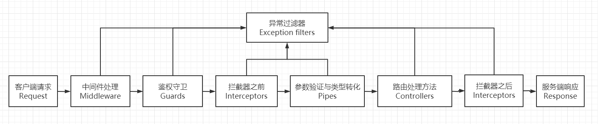

# Nest 体系结构

## 什么是 Nest

`Nest` 是用于构建高效，可扩展的 `Node.js` 服务器端应用程序的框架。它支持 JavaScript ECMA 6+，并使用 TypeScript 构建，并结合了 OOP（面向对象编程），FP（函数式编程）和 FRP（响应式编程）的元素。

`Nest` 并不是一个从零开始的框架，它是基于 [Express](https://expressjs.com/) 之上实现的一个解决方案，而且还提供与众多其他库的兼容性。同时也支持 [Fastify](https://github.com/fastify/fastify)，允许轻松使用无数的第三方插件可用。

- 源码：[code](https://github.com/nestjs/nest)
- 脚手架：[cli](https://github.com/nestjs/nest-cli)
- 文档：[docs](https://nestjs.com/)
- 资源：[awesome](https://github.com/juliandavidmr/awesome-nestjs)

## 设计理念

近年来，随着`Node.js`的出现，有太多可用的 `Web` 框架，催生了 [Angular](https://angular.io/) 、[React](https://github.com/facebook/react) 和 [Vue](https://github.com/vuejs/vue)等优秀项目，这些项目提高了开发人员的生产力，并能够构建快速、可测试、可扩展的前端应用。在服务器端，也有 [Express](https://expressjs.com/)、[koa](https://github.com/koajs/koa) 和 [Fastify](https://github.com/fastify/fastify) 等优秀项目。尽管有很多优秀的库、辅助和工具，但没有一个能有效地解决主要问题——架构。

随着 `Web` 技术的变化和发展，`JavaScript` 框架的风格很快就会变坏。对于许多希望使用现代 `Web` 框架的开发人员来说，`Nest.js` 是一个很好的起点，因为它使用的语言是当今最流行的 `TypeScript`，这门语言和 `JavaScript` 非常相似。许多开发人员被教导使用诸如 `Java` 或 `C/C++` 之类的语言进行编程，这两种语言都是严格的语言，因此，由于缺乏类型安全性，使用 `JavaScript` 可能有点笨拙并且容易出错。

`Nest.js` 使用 `TypeScript`，这是一种很好尝试。`TypeScript` 是一种语言，它提供`JavaScript` 的简单性和强大功能以及熟悉的其他语言的类型安全性。`Nest.js` 中的类型安全仅在编译时可用，因为 `Nest.js` 服务器已编译为运行 `JavaScript` 的 `Node.js` `Express`服务器。但是，这仍然是一个主要优点，因为它使我们可以在运行前更好地设计程序而不会出错。

`Node.js` 在 [NPM](https://www.npmjs.com/)（Node 程序包管理器）中具有丰富的程序包生态系统。它拥有超过 `500,000` 个软件包，是世界上最大的软件包注册中心。基于`Express`和`Fastify`之上的 `Nest.js`，使你完全不用担心，在开发 `Nest` 应用程序时，你可以轻松访问 `Express` 和 `Fastify` 生态软件包。许多人甚至为其包提供了[类型定义](https://github.com/borisyankov/DefinitelyTyped)，从而使`IDE`可以读取包并文档提示/自动补全代码，提升编码效率和程序健壮性。

`Node.js` 的最大好处之一就是庞大的模块存储库，可从中提取模块，而不必自己编写。 `Nest.js` 将其中一些常用模块已作为 `Nest` 平台的一部分，例如 `@nestjs/mongoose`，它使用`NPM` 库 `mongoose`。后面我们会大量介绍并优先使用 `Nest` 提供模块。

`Angular` 是 `Nest.js` 开发的重要灵感，因为两者都使用允许重复使用的 `Module/Component` 系统。

`Angular` 它是一个基于 `TypeScript` 的前端框架，可以跨平台使用它来开发响应式 Web 应用程序和本机应用程序，并且其功能与 `Nest` 一样。两者与 `Nest` 搭配使用也非常好， `Nest` 提供了运行通用服务器以服务于预渲染的 `Angular` 网页的能力，从而可以使用服务器端渲染（SSR）加快网站的交付速度。

`Nest` 旨在提供一种开箱即用的应用程序体系结构，该体系结构允许轻松创建高度可测试，可扩展，低耦合且易维护的高效应用程序。该架构在很大程度上受到了 [Angular](https://angular.io/) 的启发。

## 特点

- 扩展性
  - 通过模块化架构，允许使用任何其他库，从而为你提供真正的灵活性。
- 通用性
  - 一个适应性强的生态系统，是各种服务器端应用程序的完整骨干。
- 渐进式
  - 利用最新的 `TypeScript` 功能，将设计模式和成熟的解决方案带入 `node.js` 世界。

## 分层架构

Nest 体系结构里面强调分层架构。MVC 架构：

- 表现层(UI)：展现给用户的界面，前端接管。
- 业务逻辑层(BLL)：针对具体问题的操作，也可以说是对数据层的操作，对数据业务逻辑处理。
- 数据访问层(DAL)：操作数据库，针对数据的增添、删除、修改、查找等。

业务逻辑层在体系架构中的位置很关键，它处于数据访问层与表示层中间，起到了数据交换中承上启下的作用。由于层是一种弱耦合结构，层与层之间的依赖是向下的，底层对于上层而言是“无知”的，改变上层的设计对于其调用的底层而言没有任何影响。如果在分层设计时，遵循了面向接口设计的思想，那么这种向下的依赖也应该是一种弱依赖关系。因而在不改变接口定义的前提下，理想的分层式架构，应该是一个支持可抽取、可替换的“抽屉”式架构。正因为如此，业务逻辑层的设计对于一个支持可扩展的架构尤为关键，因为它扮演了两个不同的角色。对于数据访问层而言，它是调用者;对于表示层而言，它却是被调用者。依赖与被依赖的关系都纠结在业务逻辑层上，如何实现依赖关系的解耦，则是除了实现业务逻辑之外留给设计师的任务。

Nest 体系结构主要核心是处理业务逻辑层，Nest 又进行细化，让它们职责更加分明。

## 体系结构

- Bootstrapping
- Modules
- Controllers
- Providers
- Middleware
- Filters
- Pipes
- Guards
- Interceptors

## Bootstrapping

每个`Nest.js`应用程序都需要`Bootstrapping`。 通过使用`NestFactory`创建根模块并调用`listen()`方法来完成此操作。在应用程序中，入口点是`main.ts`，我们使用 `async/await` 模式以创建`AppModule`并调用`listen`：

```ts
import { NestFactory } from '@nestjs/core';
import { AppModule } from './app/app.module';

async function bootstrap() {
  const app = await NestFactory.create(AppModule);
  const port = process.env.port || 3333;
  await app.listen(port, () => {
    console.log(`Listening at http://localhost:${port}`);
  });
}

bootstrap();
```

> `bootstrap`方法是启动 Nest 应用程序入口，你可以初始化应用程序配置等操作。尽量保证`bootstrap`方法简洁。后面我们会介绍如何让`bootstrap`简洁，看起来干净，利于维护和扩展。

## Modules(模块)

`Nest.js` 的基本构造块是 `Module`。它为 `Controllers`（控制器）提供了编译的上下文环境。 `Module` 会把相关的代码收集到一些功能集中。`Nest.js` 应用就是由一组 `Module` 定义出的。 应用至少会有一个用于引导应用的根模块，通常还会有很多特性模块。

- 控制器定义路由。路由是一组前后端交互桥梁，`Nest.js` 可以根据你的程序逻辑和数据来选择和修改它们。每个应用都至少有一个根控制器。
- 控制器使用服务。服务会提供那些与视图不直接相关的功能。服务提供者可以作为依赖被注入到控制器中，这能让你的代码更加模块化、更加可复用、更加高效。

`Nest.js` 定义了 `Module`，它和 JavaScript（ES2015） 的模块不同而且有一定的互补性。 `Module` 为一个控制器集声明了编译的上下文环境，它专注于某个应用领域、某个工作流或一组紧密相关的能力。 `Module` 可以将其控制器和一组相关代码（如服务）关联起来，形成功能单元。

每个 `Nest.js` 应用都有一个根模块，通常命名为 `AppModule`。根模块提供了用来启动应用的引导机制。一个应用通常会包含很多特性模块。

像 `JavaScript` 模块一样，`Module`也可以从其它 `Module`中导入功能，并允许导出它们自己的功能供其它 `Module`使用。 比如，要在你的应用中使用配置（Config）服务，就要导入 `ConfigModule` 这个 `Module`。

> 把你的代码组织成一些清晰的特性模块，可以帮助管理复杂应用的开发工作并实现可复用性设计。

在 `Nest.js` 声明一个模块：

```ts
// @Module 是声明模块装饰器
@Module({
  controllers: [], // 此模块中定义的必须实例化的一组控制器
  providers: [], // Nest注入器将实例化的服务，并且至少可以在此模块之间共享这些服务
  imports: [], // 此模块中所需的服务的导入模块列表
  exports: [], // 导出该模块的其他模块中可用服务列表
})
export class AppModule {}
```

默认情况下，模块封装提供程序。降低层与层之间的依赖，利于各层逻辑的复用，让结构更加的明确，在后期维护的时候，极大地降低了维护成本和维护时间。这意味着不可能注入既不是当前模块的直接组成部分，也不是从导入的模块导出的提供程序。

> 在 Nest 中，模块默认是单例的，因此你可以毫不费力地在多个模块之间共享任何提供程序的相同实例。

模块分类：

- 根模块（AppModule）：应用唯一模块，用来启动应用的引导机制。
- 特性模块（Feature modules）：业务模块，将我们业务拆分成独立模块是一个非常好实践。
- 核心模块（Core Module）：核心模块，用于配置整个应用模块，只能被根模块导入使用。
- 共享模块（Shared modules）：共享模块，可以抽象通用的服务，为特性模块提供支持。
- 全局模块（Global modules）：全局模块提升服务作用域，高级共享模块，需要使用 `@Global()` 装饰器。
- 动态模块（Dynamic modules）：该特性使我们能够轻松创建可定制的模块，这些模块可以动态注册和配置提供程序。

> 这些模块分类贯穿我们整个应用程序，后面代码中都有体现。

## Controllers（控制器）

控制器负责处理传入的请求并将响应返回给客户端。控制器的目的是接收对应用程序的特定请求。路由机制控制哪个控制器接收哪个请求。通常，每个控制器具有多个路由，并且不同的路由可以执行不同的操作。

控制器定义路由（Routing），是前后端交互的灵魂。每个路由对应一个`HTTP request/response`。

在 `Nest.js` 声明一个控制器：

```ts
// @Controller 是声明控制器装饰器
@Controller('user')
export class UserController {
  @Get()
  findAll(@Req() request: Request): string[] {
    return [];
  }
}
```

控制器提供路由上很多对应的装饰器和特性功能：

- Request object：`@Request`、`@Response`、`@Next`、`@Session`、`@Param`、`@Body`、`@Query`、`@Headers`、`@Ip`
- Resources：`@Get`、`@Post`、`@Put`、`@Delete`、`@Patch`、`@Options`、`@Head`、`@All`
- Versioning：`@Version`，版本控制允许您在同一应用程序中运行不同版本的控制器或单独的路由。
- Route wildcards：支持正则模式的路由匹配。例如，星号用作通配符，将匹配任何字符组合。
- Status code：`@HttpCode`，支持所有的 HTTP Code
- Headers: `@Headers`，指定自定义响应头
- Redirection：`@Redirect`，将响应重定向到特定的 URL
- Route parameters：`@Get(':id')`，使用 `@Param('id')` 接受动态参数
- Asynchronicity：使用`async/await` 处理异步
- Request payloads：使用 `DTO(Data Transfer Object)` 模式，传递，验证，处理请求参数。
- Handling errors：异常捕获

> 控制器是我们业务一个核心，我们接下来会大量使用到上面提到特性。

## Providers（服务）

服务是一个广义的概念，它包括应用所需的任何值、函数或特性。狭义的服务是一个明确定义了用途的类。它应该做一些具体的事，并做好。

`Nest.js`把控制器和服务区分开，以提高模块性和复用性。通过把控制器中和业务有关的功能与其它类型的处理分离开，你可以让控制器类更加精简、高效。

理想情况下，控制器的工作只管请求和响应，而不用顾及其它。它应该提供用于请求数据验证和拦截的方法，以便作为请求数据和应用逻辑的中介者。

控制器应该把诸如从数据库获取数据、验证用户输入或直接往控制台中写日志等工作委托给各种服务。通过把各种处理任务定义到可注入的服务类中，你可以让它被任何控制器使用。通过在不同的环境中注入同一种服务的不同提供者，你还可以让你的应用更具适应性。

`Nest.js`会通过依赖注入来帮你更容易地将应用逻辑分解为服务，并让这些服务可用于各个控制器中。

在 `Nest.js` 声明一个服务：

```ts
// @Injectable 是声明控制器装饰器
@Injectable()
export class UserService {
  findAll(): string[] {
    return [];
  }
  // 依赖注入
  constructor(
    // 注入类级别服务
    private catsService: CatsService,
    // 注入可选服务 可选服务使用@Optional()
    @Optional() @Inject('HTTP_OPTIONS') private httpClient: T,
    // 注入属性服务 属性级别使用@Inject()装饰器
    @Inject('HTTP_OPTIONS2') private readonly httpClient2: T;
  ) {}
}
```

服务类型：

- Class Service：{ provide: CatsService, useClass: CatsService }，如果`provide`和`useClass`一样，可以简写 CatsService
- Value Service：{ provide: 'CONNECTION', useValue: connection }，需要使用`@Inject()`装饰器注入，类似于变量
- Factory Service：{ provide: 'CONNECTION', useFactory: () => {}, inject: [] }，依赖其他服务，动态创建一个服务
- Existing Service：{ provide: 'AliasedLoggerService', useExisting: LoggerService }，给服务起一个别名。

> 我们一般用到的类服务、值服务、工厂服务比较多，别名服务相对比较少。工厂服务支持 `async/await` 处理异步服务

`Modules`、`Controllers`、`Providers` 彼此相互依赖，也可以相互独立。

`Modules` 决定了 `Providers` 的作用域范围。`Controllers` 决定了 `Providers` 的上下文。

> 这两句话，现在理解比较抽象，我们在代码使用时候你就会发现它们关系。接下来讲解几个概念都是和 `Controllers` 相关联，我们又叫它 `Request lifecycle`

## Middleware（中间件）

`Nest.js` 中间件是使用实现 `NestMiddleware` 接口的 `@Injectable()` 装饰器装饰的函数或类。中间件按特定顺序执行。首先，`Nest` 运行全局绑定的中间件（例如与 `app.use` 绑定的中间件），然后运行模块绑定的中间件，该中间件在路由上确定。中间件按照它们绑定的顺序顺序运行，类似于 `Express` 中的中间件工作方式。

在路由处理程序之前调用中间件。这些功能可以访问请求和响应对象，并且可以更改请求和响应对象。可以为一个路由配置一个或多个中间件功能，并且中间件功能可以选择将执行传递给堆栈上的下一个中间件功能或结束请求-响应周期。如果中间件函数没有结束请求-响应周期，则它必须调用`next()`才能将控制权传递给下一个中间件函数或请求处理程序（如果它是堆栈中的最后一个函数）。否则，请求将被挂起。

`Nest.js` 的中间件也完全保留了 `Express` 中的中间件的特点：

- 在中间件中接受 `response` 和 `request` 作为参数，并且可以修改请求对象 `request` 和结果返回对象 `response`
- 可以结束对于请求的处理，直接将请求的结果返回，也就是说可以在中间件中直接 `res.send` 等。
- 在该中间件处理完毕后，如果没有将请求结果返回，那么可以通过 `next` 方法，将中间件传递给下一个中间件处理。

## Filters（过滤器）

过滤器是使用实现 `ExceptionFilter` 接口的 `@Catch()` 装饰器装饰的函数或类。过滤器是唯一不能全局优先解析的组成部分。取而代之的是，过滤器从可能的最低级别进行解析，这意味着执行从任何路由绑定的过滤器开始，然后继续到控制器级别，最后到全局过滤器。请注意，不能在过滤器之间传递异常。如果路由级别过滤器捕获到异常，则控制器或全局级别过滤器无法捕获相同的异常。达到这种效果的唯一方法是在过滤器之间使用继承。

仅在请求过程中发生任何未捕获的异常时才执行过滤器。捕获的异常（例如使用 `try/catch` 捕获的异常）不会触发异常过滤器触发。一旦遇到未捕获的异常，生命周期的其余部分将被忽略，并且请求将直接跳到过滤器。

## Pipes（管道）

管道是使用实现 `PipeTransform` 接口的 `@Injectable()` 装饰器装饰的函数或类。管道遵循标准的从全局到控制器路由绑定顺序，对于 `@usePipes()` 参数来说，具有相同的先入先出顺序。但是，在路由参数级别上，如果有多个管道在运行，它们将以最后一个参数的顺序运行，并通过管道连接到第一个。这也适用于路由级别和控制器级别的管道。

管道一般用于验证请求中参数是否符合要求，或者转化参数的类型。

`Nest` 带有八个开箱即用的管道：

- ValidationPipe
- ParseIntPipe
- ParseFloatPipe
- ParseBoolPipe
- ParseArrayPipe
- ParseUUIDPipe
- ParseEnumPipe
- DefaultValuePipe

## Guards（守卫）

守卫是使用实现 `CanActivate` 接口的 `@Injectable()` 装饰器装饰的函数或类。守卫负责确定是否应由路由处理程序或路由处理请求。守卫是
在每个中间件之后但在管道之前执行。 与中间件不同，守卫可以访问 `ExecutionContext` 对象，因此他们确切地知道要干什么。

守卫一般用于身份验证，也就是鉴权处理。对于守卫处理函数，如果返回 `true`，那么请求会被正常的处理，如果返回 `false` 那么请求会抛出异常。

## Interceptors（拦截器）

拦截器是使用实现`NestInterceptor`接口的`@Injectable()`装饰器装饰的函数或类。拦截器在大多数情况下都遵循与守卫相同的模式，但有一个陷阱：拦截器返回 `RxJS Observable` 时，将以后进先出的方式解析该`Observable`。因此，入站请求将通过标准的全局，控制器，路由级别解析，但是请求的响应端（即从控制器方法处理程序返回后）将从路由到控制器再到全局解析。此外，管道、控制器或服务抛出的任何错误都可以从拦截器的 `catchError` 操作符中读取。

## Request lifecycle（请求的生命周期）

`Nest`应用程序按我们称为请求生命周期的顺序处理请求并产生响应。通过使用 `Middleware`（中间件），`Pipes`（管道），`Guards`（守卫）和 `Interceptors`（拦截器），跟踪在请求生命周期中特定代码执行的位置可能会非常具有挑战性，尤其是在全局，控制器级别和路由级别组件开始发挥作用时。通常，请求通过中间件流向守卫，然后流向拦截器，然后流向管道，最后流回到返回路由上的拦截器（随着响应的产生）。

请求生命周期如下所示：

1. Incoming request
2. Globally bound middleware
3. Module bound middleware
4. Global guards
5. Controller guards
6. Route guards
7. Global interceptors (pre-controller)
8. Controller interceptors (pre-controller)
9. Route interceptors (pre-controller)
10. Global pipes
11. Controller pipes
12. Route pipes
13. Route parameter pipes
14. Controller (method handler)
15. Service (if exists)
16. Route interceptor (post-request)
17. Controller interceptor (post-request)
18. Global interceptor (post-request)
19. Exception filters (route, then controller, then global)
20. Server response

请求生命周期：



## 总结

如果你有服务端的基础，特别是 `Java`，使用 `NestJs` 上手很快，如果你有 `Angular` 基础，你上手 `NestJs` 很快，但需要你有服务端的认知。后面结合具体业务代码，我们还会深入讲解这些概念，它们将贯穿我们整个`Nest`应用程序。
